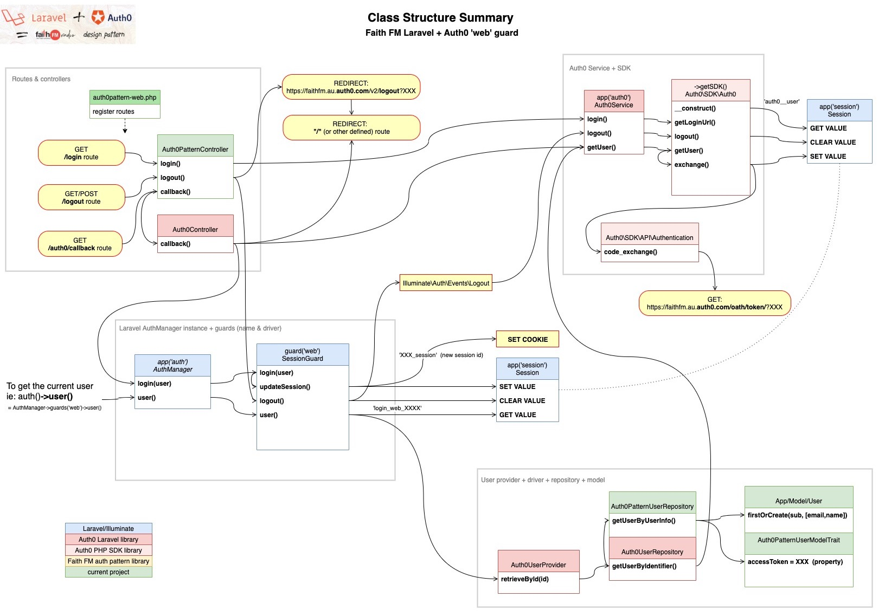

# laravel-auth0-pattern


An Auth0-based library/pattern for Laravel Authentication and Authorisation:  (developed for Faith FM web projects)

* **AuthN** (Authentication) implemented using **Auth0** linked to a Eloquent User model...
  * ...but retaining simple **token-based** AuthN capabilities (ie: '?api_token=XXXX')
  * ...and including protection against creating hundreds of session-files.
* **AuthZ** (Authorization)  with simple **'user-permissions' table** (combined with Laravel/Vue-JS helper Gates & Checks)
*

This repo is a PHP Composer package created to improve consistency across our existing Faith FM Laravel+Vue projects.  (Previously we had been trying to maintain multiple copies of these files across multiple projects).

## Background

* The need for our own library/pattern initially arose from the complexity required to use Auth0 in a Laravel app, since the [auth0/login](https://github.com/auth0/laravel-auth0) library (pre-v7.0) did not provide an easy way for auth()->user() to return a genuine User model... and this tends to break compatibility with much of the Laravel ecosystem including Laravel Nova.
* Much of this complexity was resolved in v7.0 of [auth0/login](https://github.com/auth0/laravel-auth0) (v2.0 of our library/pattern), but the Auth0-to-Model connection still requires implementation in a [User Repository](src/Auth0PatternUserRepository.php).
* ...and the need for a consist approach across our projects still remains.

## Installation

See [installation instructions](docs/installation.md).  

> Note: This Composer library is installed directly from Github (not currently registered with packagist.org).  

## Basic Usage

* Define a simple list of permissions your app will use (in [`Repositories/AuthPermissionList.php`](templates/app/Repositories/AuthPermissionList.php) - templated file).

* Add these permissions for each of your relevant users (in the "user_permissions" table).

* The '*restrictions*' column is a JSON field that can **optionally** be used to define specific restrictions/qualifications to a privilege.  Ie: our Media project uses 'filter' and 'fields' to restrict users to editing specific files/fields.

```JSON
  { "fields":["content","guests"], "filter":"file:sa/*" }
```

## Usage - Laravel back-end

In the backend check for permissions in the same way you would any other gate - ie:

Simple permission checks:

```php
Gate::allows('use-app');            // simple test  (???untested)
Gate::authorize('use-app');         // route definitions
$this->middleware('can:use-app');   // controller constructors
@can('use-app')                     // blade templates
```

To use multiple guards the middleware name syntax is:

```php
$this->middleware('auth.patched:api_guard,web_guard'); //controller constructors using api and web guards
```

More complex restrictions-field checking/filtering has currently only been implemented in the front-end (see next section)... but in the mean-time you could probably use something like this:   (UNTESTED)

```php
if (Gate::allows('use-app'))
  if (auth()->user()->permissions->restrictions['file'] == 'restrictedfile')
    // ALLOW/DENY STUFF FROM HAPPENING
```

## Usage - Vue front-end

`LaravelUserPermissions.js` is a helper library that allows permission-checks to be performed in the front-end.  

This helper assumes that user permissions are passed from back-end to front-end using a global javascript `LaravelAppGlobals` variable (which is usually passed by the Blade file).  Specifically it is looking for the existence of the global `LaravelAppGlobals.user.permissions` property.

Simple permission checks use the `laravelUserCan()` function:

```javascript
import { laravelUserCan } from "../LaravelUserPermissions";
if (laravelUserCan("use-app"))
  // ALLOW STUFF TO HAPPEN
```

More complex restrictions checks/filtering uses the `laravelUserRestrictions()` function:

```javascript
import { laravelUserRestrictions } from "../LaravelUserPermissions";
const restrictions = laravelUserRestrictions("use-app");
if (restrictions.status == "NOT PERMITTED")
  // PREVENT STUFF FROM HAPPENING
if (restrictions.status == "ALL PERMITTED")
  // UNFILTERED ACCESS
if (restrictions.status == "SOME PERMITTED") {
  // PARTIAL/FILTERED ACCESS BASED ON RESTRICTIONS JSON DATA - IE: ASSUMING 'filter' field
  if (currentItem.startsWith(restrictions.filter)
    // DO STUFF IF FILTER ALLOWS
```

In the '*restrictions*' field example from our Media project above, the *restrictions* object returned by the `laravelUserRestrictions()` function would have been:

```javascript
{
  status: "SOME PERMITTED",
  fields: ["content","guests"], 
  filter: "file:sa/*"
}
```

The value of the *status* field will be:

* `NOT PERMITTED` - if the requested permission (ie: "use-app") does not exist for the user.
* `ALL PERMITTED` - if the requested permission does exist... AND the *'restrictions'* field is blank.
* `SOME PERMITTED` - if the requested permission does exist... AND the *'restrictions'* field contains valid JSON data.

The remaining fields (ie: *fields* and *filter* in this example) are directly copied from the *'restrictions'* JSON data in the database.

> REMINDER: according to good security practice you should not rely only upon front-end checks to enforce security, but should perform security checks in the back-end too.

## Sample code to pass permissions via LaravelAppGlobals to front-end

```php
  $LaravelAppGlobals = [
    'user' => auth()->user(),     # THIS IS THE IMPORTANT ONE
    'guest' => auth()->guest(),
    'other-stuff' => $myStuff,
    ...
  ];
  return view('media')->with('LaravelAppGlobals', $LaravelAppGlobals);
```

```html
<!doctype html>
<head>
    <!-- Scripts -->
    <script>
        var LaravelAppGlobals = Object.freeze({!! json_encode($LaravelAppGlobals) !!});
    </script>
...
```

## Usage in different packages that require auth
  
* To allow the audit package to use the new guards you should replace in `config/audit.php`. Replace the guards use by the user

```diff
    'user' => [
        'morph_prefix' => 'user',
        'guards' => [
-           'web',
-           'api',
+           'web_guard',
+           'api_guard',
        ],
    ],
```

* Change `config/larecipe.php`

```diff
//Documentation Routes

'docs' => [
        'route' => '/docs',
        'path' => '/resources/docs',
        'landing' => 'sched-editor-colour-schemes',
-       'middleware' => ['web'],
+       'middleware' => ['web_group'],
    ],
   ...
   'settings' => [
        'auth' => false,
        'guard' => null,
        'ga_id' => '',
        'middleware' => [
-           'web',
+           'web_group',
        ],

```

* Change `config/nova.php`

```diff
+use Auth0\Laravel\Http\Middleware\Stateful\Authenticate;
-//use Laravel\Nova\Http\Middleware\Authenticate;
... 
//Nova Route Middleware
'middleware' => [
-       'web',
+       'web_group',
        HandleInertiaRequests::class,
        DispatchServingNovaEvent::class,
        BootTools::class,
    ],

    'api_middleware' => [
        'nova',
-       Authenticate::class,
+       PatchedAuthenticationMiddleware::class,
        Authorize::class,
    ],
```

## Architecture

> **WARNING**: auth0/login v7.0 introduced **major architectural changes** which were implemented in v2.0 of this library/pattern.  This architectural documentation has NOT BEEN UPDATED.

Compared to other Auth0 PHP code we've seen, Auth0's Laravel library + quickstart introduces an extremely complex (yet flexible) architecture we found very difficult to understand + debug.  We ended up producing a whole set of [documentation](docs/underderstanding-laravel-auth0-authn+authz.md) + [diagrams](docs/laravel-auth0-pattern-diagram.pdf) to help us get our heads around this.  

Hopefully this can be helpful to someone else - whether you're using our library... or simply if you're trying to understand the code from the [Auth0 Laravel Quickstart](https://auth0.com/docs/quickstart/webapp/laravel).

> WARNING: No guarantees are made as to the accuracy of this information.  It was simply our own brain-dump as we tried to decode it all... which then resulted in a number of [diagrams](docs/laravel-auth0-pattern-diagram.pdf) to try to provide a simplified perspective.

> NOTE: the diagrams are the most up-to-date resource.  We didn't try to go back and align our other documentation
 after producing them... OR after RENAMING a few things in the library.



## Future Development

> **NOTE**: the remarks in this section may no longer be relevant, since auth0/login v7.0 may have fixed them.  (NOT CHECKED YET)

* During initial development we regularly experienced issues with "Invalid State" errors.  (See our Auth0 Community [support request](https://community.auth0.com/t/handling-laravel-callback-exceptions-invalid-state-and-cant-initialize-a-new-session-while-there-is-one-activ/45103)).  While developing this documentation we discovered that the endless loop for the error *“Can’t initialize a new session while there is one active session already”* can be fixed by the following code - which we executed in a debug session... but haven't yet incorporated into our codebase.

```php
    session()->forget('auth0\_\_user')
```

* In the future, it is anticipated that some variations may be required between projects.  At this time the simplistic cloned/force-publish deploy method for Models will need to be replaced by a more sophisticated approach - ie: using Laravel Traits / parent Classes, etc.

* Auth0's code is not retrieving the 'user_metadata' data during code-exchange.  We have unsuccessfully tried a few things, but moved on to other priorities.  Notes from initial research saved under [documentation / future research](docs/underderstanding-laravel-auth0-authn+authz.md#future-research).

* Could create a migration to remove the (unused) "password_resets" table (as mentioned in the quickstart)... but care needed because this could be destructive if accidentally run against the wrong environment.

## General Notes

* Assumes that Laravel Auditing ([owen-it/laravel-auditing](https://github.com/owen-it/laravel-auditing) package) is applied for all models.

* Files to be cloned/force-published are found in the "clone" folder - with a structure matching target folders of the target project.
