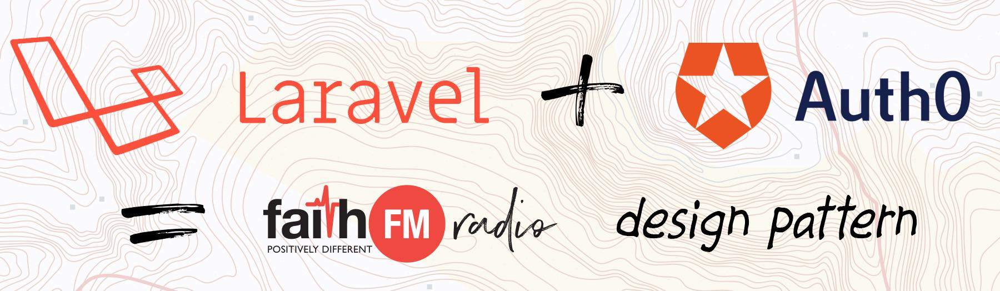
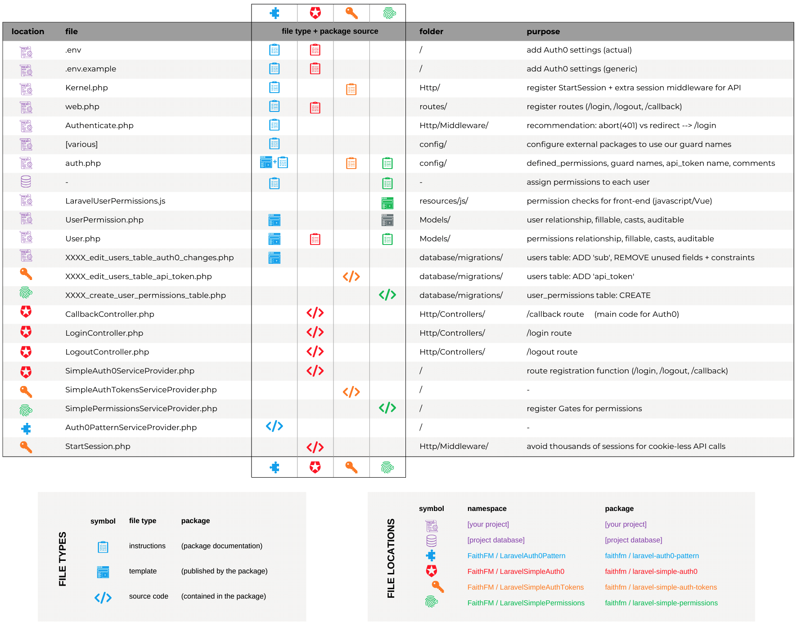
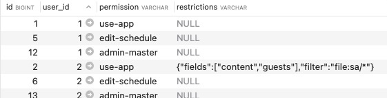

# laravel-auth0-pattern



An opinionated library/pattern for Laravel Authentication (AuthN) and Authorisation (AuthZ) - designed to improve consistency across our Faith FM Laravel/Vue projects.

Much of the functionality of our pattern is now contained in **3x reusable packages** that will be of more widespread interest to other developers:

* [laravel-**simple-auth0**](https://github.com/faithfm/laravel-simple-auth0) - simple **session**-based Authentication using **Auth0**.
  
* [laravel-**simple-auth-tokens**](https://github.com/faithfm/laravel-simple-auth-tokens) - simple **token**-based Authentication using **API keys** (ie: `?api_token=XXXX`).  
* [laravel-**simple-permissions**](https://github.com/faithfm/laravel-simple-permissions) - simple **Permissions** / Authorization Gates using the *'user_permissions'* table / Eloquent model.

> In v4.0.0 we replaced the official [Auth0 Laravel SDK](https://github.com/auth0/laravel-auth0) with our own lightweight *laravel-simple-auth0* package, and split other functionality into reusable packages.  Our *laravel-simple-auth0* uses Laravel's built-in Session-Guard and an Eloquent User model retrieved using the 'sub' identifier provided by a [simple Auth0 PHP flow](https://auth0.com/docs/quickstart/webapp/php)).[^1]


## Structure:

Our pattern:

* Imports the 3x reusable packages.
* Publishes a number of opinionated templates that are re-used across our applications.
* Provides configuration and usage instructions and guidance.


The key files required/provided are:

[](https://www.canva.com/design/DAGEfYrNYng/rDMsUUS3jrcCMHGQLHMu3g/edit)


## Installation and Configuration:

* Apply the basic [installation and configuration](docs/installation.md) instructions.

* Configure [external packages](docs/external-package-config.md) such as Laravel Nova and OwenIT Auditing.

* Configure Auth0 *(including allowed callback routes)* and add Auth0 settings to your **.env** file:    

  *(It's wise to update **.env.example** template too.  See [faithfm/**laravel-simple-auth0**](https://github.com/faithfm/laravel-simple-auth0?tab=readme-ov-file#configuration) package for further details regarding Auth0 configuration, etc.)*

  ```php
  AUTH0_DOMAIN=XXXX.xx.auth0.com
  AUTH0_CLIENT_ID=XXXXXXXXXXX
  AUTH0_CLIENT_SECRET=XXXXXXXXXXXXXXXXXXXXXXXXXXXXXXXXXXXXXXXXXXXX
  ```


* Define the list of allowable Permissions in config/**auth.php**:

```php
'defined_permissions' => [
    'use-app',                  // minimum permission to use the app
    'admin-app',                // master admin privilege
//  'edit-catalog',             // for catalog editors  (assuming you're writing a catalogue application)
],
```

* Assign permissions to users via the `user_permissions` table:

  *(The 'restrictions' column is a JSON field that can **optionally** be used to define specific restrictions/qualifications to a privilege.  Ie: our Media project uses 'filter' and 'fields' to restrict users to editing specific files/fields.)*




## How It Works

* The /login, /logout, /callback routes that enable session-based authentication are documented in [laravel-**simple-auth0**](https://github.com/faithfm/laravel-simple-auth0?tab=readme-ov-file#how-it-works). 

* The `api_key=XXX` token-based authentication is documented in [laravel-**simple-auth-tokens**](https://github.com/faithfm/laravel-simple-auth-tokens?tab=readme-ov-file#how-it-works). 
* The [Authorization Gates](https://laravel.com/docs/master/authorization) automatically created for all `'defined_permissions'` in config/**auth.php** are documented in [laravel-**simple-permissions**](https://github.com/faithfm/laravel-simple-permissions).
* Our *User* and *UserPermission* models incorporate the [owen-it/laravel-auditing](https://github.com/owen-it/laravel-auditing) package which is used to audit changes to models across our projects.  *(This package is a composer dependency.)*
* Our learnings from developing an understanding of authentication + authorization - particularly in the context of Laravel + Auth0 have been [documented here](docs/underderstanding-laravel-auth0-authn+authz.md) for what they're worth.


## Usage

Our pattern uses non-standard **Authentication Guard** names for [greater clarity and disambiguation](docs/disambiguation-auth-guard-vs-middleware-group-names.md):

* **'web'** (Laravel default) --> **'web_guard'** (v2.2.0) --> **'ffm-session-guard'** (v3.0.0)    [based on SessionGuard driver]

* **'api'** (Laravel default) --> **'api_guard'** (v2.2.0) --> **'ffm-token-guard'** (v3.0.0)    [based on TokenGuard driver]


**Authentication Examples:**

Apart from that our pattern supports all Laravel's normal [authentication](https://laravel.com/docs/master/authentication) (AuthN) methods to check if logged in, protect routes, retrieve a user, etc:

```php
// Check a user is logged in - using a variety of methods   (default guard is our session-based Auth0 guard)
$loggedIn = auth()->check();                         // using helper function  (default guard)
$loggedIn = Auth::check();                           // using Facades          (default guard)
$loggedIn = auth('ffm-session-guard')->check();      // session-based guard specified - ie: using Auth0
$loggedIn = auth('ffm-token-guard')->check();        // token-based guard specified - ie: api_token=XXX
$loggedIn = Auth::guard('ffm-token-guard')->check(); // token-based guard specified using Facades

// Various useful guard functions - using the helper function and the default guard
auth()->user()          // Eloquent model for the logged-in User
auth()->id()            // User ID for this user - ie: user()->getAuthIdentifier()
auth()->check()         // TRUE  if logged in
auth()->guest()         // FALSE if logged in
auth()->authenticate()  // throw AuthenticationException if not logged in  (similiar to middleware checks)

// Protect routes using 'auth' (Authenticate) middleware - throw AuthenticationException if not logged in
Route::get(...) { ... }
  ->middleware('auth');                                   // using default guard
  ->middleware('auth:ffm-token-guard');                   // specifying token-based guard
  ->middleware('auth:ffm-session-guard,ffm-token-guard'); // allow EITHER session-based OR token-based guards
```

When multiple alternative guards have been specified via middleware (ie: the last example above), all authentication calls inside this route are implicitly resolved using the first authenticated guard that was found:      *(The middleware calls the shouldUse() method which overrides the configured default guard.)*

```php
Route::get('/showuser', function () {
    return auth()->user();	// session-based or token-based guard will automatically be used depending on first authenticated guard found during middleware check
})->middleware('auth:ffm-session-guard,ffm-token-guard');
```

We also have created an extended `auth_guards()` helper that allows **multiple guards** to be specified, since unfortunately neither Laravel's `guard()` helper nor `Auth::guard()` facade support multiple guards **outside** of a middleware-protected-route - ie:

```php
$user = auth()->user();                 // default guard   = SUPPORTED
$user = auth('api')->user();            // specific guard  = SUPPORTED
$user = auth('web,api')->user();        // multiple guards = NOT SUPPORTED
$user = auth_guards('web,api')->user(); // multiple guards = SUPPORTED (extended helper)
```


**Authorization Examples:**

Check for **permissions** (AuthZ) using the [Authorization Gates](https://laravel.com/docs/master/authorization) that have been automatically created for all `'defined_permissions'` in config/**auth.php**:  

```php
$allowed = Gate::allows('use-app');             // simple test
$allowed = Gate::allows('use-app|edit-assets'); // ORed permissions (SPECIAL FEATURE)
...->middleware('can:use-app');                 // protect in route definitions
Gate::authorize('use-app');                     // protect elsewhere (ie: controllers)
@can('use-app')                                 // blade templates
```

> Notice the special '|' character that can be used to test multiple (ORed) permissions in a single gate.  This is an extension to Laravel's normal functionality.

More complex restrictions-field checking/filtering has currently only been implemented in the front-end (see next section)... but in the mean-time we could potentially use something like this:   (UNTESTED)

```php
if (Gate::allows('use-app'))
  if (auth()->user()->permissions->restrictions['file'] == 'restrictedfile')
    // ALLOW/DENY STUFF FROM HAPPENING
```


## Extended Usage: Vue front-end

`LaravelUserPermissions.js` is a helper library that allows permission-checks to be performed in the front-end.  

This helper assumes that user permissions are passed from back-end to front-end using a global javascript `LaravelAppGlobals` variable (which is usually passed by the Blade file).  Specifically it is looking for the existence of the global `LaravelAppGlobals.user.permissions` property.

Simple permission checks use the `laravelUserCan()` function:

```javascript
import { laravelUserCan } from "../LaravelUserPermissions";
if (laravelUserCan("use-app"))
  // ALLOW STUFF TO HAPPEN
```

More complex restrictions checks/filtering uses the `laravelUserRestrictions()` function:

```javascript
import { laravelUserRestrictions } from "../LaravelUserPermissions";
const restrictions = laravelUserRestrictions("use-app");
if (restrictions.status == "NOT PERMITTED")
  // PREVENT STUFF FROM HAPPENING
if (restrictions.status == "ALL PERMITTED")
  // UNFILTERED ACCESS
if (restrictions.status == "SOME PERMITTED") {
  // PARTIAL/FILTERED ACCESS BASED ON RESTRICTIONS JSON DATA - IE: ASSUMING 'filter' field
  if (currentItem.startsWith(restrictions.filter)
    // DO STUFF IF FILTER ALLOWS
```

In the '*restrictions*' field example from our Media project above, the *restrictions* object returned by the `laravelUserRestrictions()` function would have been:

```javascript
{
  status: "SOME PERMITTED",
  fields: ["content","guests"], 
  filter: "file:sa/*"
}
```

The value of the *status* field will be:

* `NOT PERMITTED` - if the requested permission (ie: "use-app") does not exist for the user.
* `ALL PERMITTED` - if the requested permission does exist... AND the *'restrictions'* field is blank.
* `SOME PERMITTED` - if the requested permission does exist... AND the *'restrictions'* field contains valid JSON data.

The remaining fields (ie: *fields* and *filter* in this example) are directly copied from the *'restrictions'* JSON data in the database.

> REMINDER: according to good security practice you should not rely only upon front-end checks to enforce security, but should perform security checks in the back-end too.

## Sample code to pass permissions via LaravelAppGlobals to front-end

```php
  $LaravelAppGlobals = [
    'user' => auth()->user(),     # THIS IS THE IMPORTANT ONE
    'guest' => auth()->guest(),
    'other-stuff' => $myStuff,
    ...
  ];
  return view('media')->with('LaravelAppGlobals', $LaravelAppGlobals);
```

```html
<!doctype html>
<head>
    <!-- Scripts -->
    <script>
        var LaravelAppGlobals = Object.freeze({!! json_encode($LaravelAppGlobals) !!});
    </script>
...
```


----

[^1]: Rationale for moving away from the official [Laravel SDK](https://github.com/auth0/laravel-auth0) (`auth0/login` package) provided by Auth0:
  We developed our own simple Auth0 package for Laravel (in v4.0.0) after spending a many hours re-integrating this pattern (and all of our Laravel apps) to retain compatibility with the changing patterns used in each major update of Auth0's official Laravel package. 

  Our applications are stateful "PHP Web Applications" (rather than stateless "PHP Backend APIs" interfacing to an SPA with JWTs), and we did not need a lot of the advanced features included in the Laravel SDK - which tended to increase the compexity unnecessarily and proved a source of pain to reintegrate with each major update.

  A significant source of pain has been that the "user provider" for the Auth0 package does not (by default) provide a regular Eloquent model... and we found the hard way that many packages (including Laravel Nova) tend to break when something other than a is returned by a user provider.

  Recent versions of the Auth0 package have improved compatibiliy for providing genuine Eloquent models, and have removed the need for many of the hacks we had to apply in earlier versions, however after spending many hours creating v3.0.0 of our package to align with improved design patterns in Auth0's package we realised that our User Repository is still building layers of complexity on top of an already-complex solution.

  Comparing these many complex layers with the simplicity of [Auth0's PHP QuickStart](https://auth0.com/docs/quickstart/webapp/php), our [laravel-**simple-auth0**](https://github.com/faithfm/laravel-simple-auth0) package now uses Auth0 **only** to validate a user and provide us a unique *'sub'* identifier.  This identifier is then used to retrieve a User model... which is passed to Laravel's built-in SessionGuard... which retrieves this same user model for subsequent authentication requests for the duration of a valid session.


