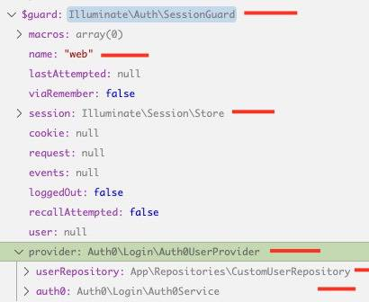
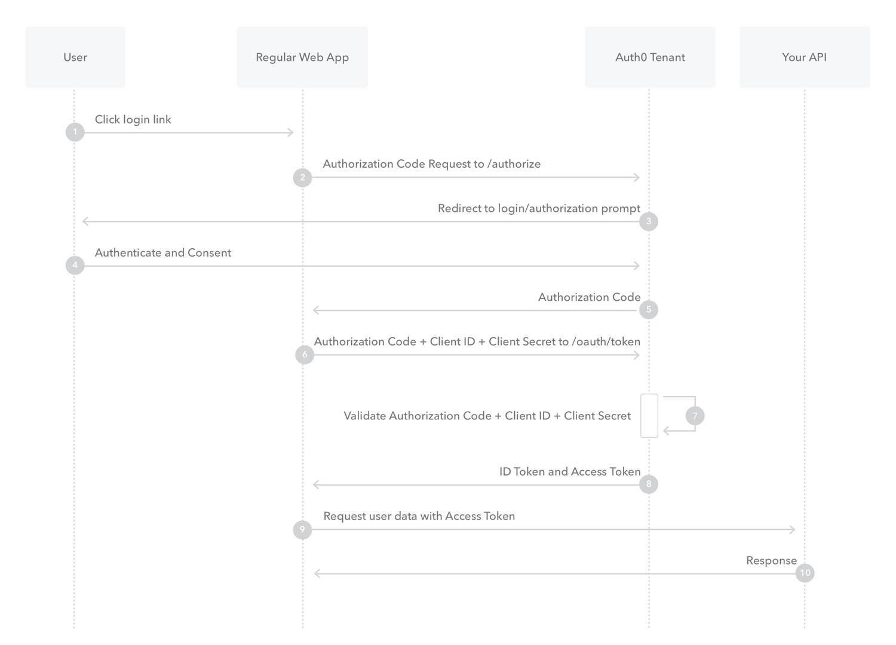
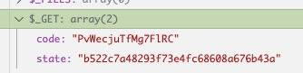
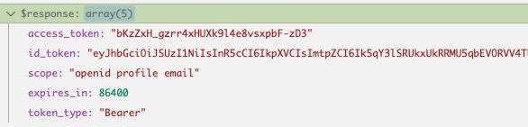
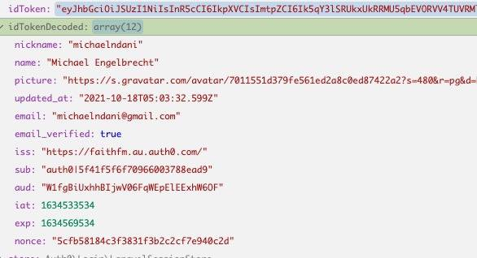
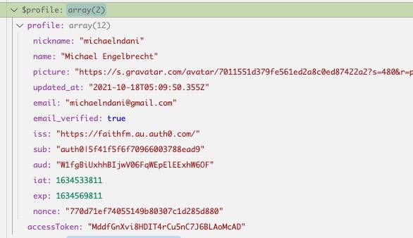
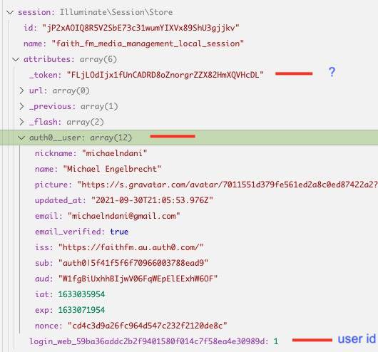

# Laravel + Auth0: Authentication + Authorisation

This is our attempt to try to document Laravel + Auth0 Authentication and Authorisation based on our adaptation of Auth0's [Laravel Quickstart](https://auth0.com/docs/quickstart/webapp/laravel) (May 2020 version).

> WARNING: No guarantees are made as to the accuracy of this information.  It was simply our own brain-dump as we tried to decode it all... which then resulted in a number of [diagrams](laravel-auth0-pattern-diagram.pdf) to try to provide a simplified perspective.


## Authentication, Authorization, State Management, and Sessions
When dealing with HTTP requests, a server usually needs to know the answers to these questions:
1. Who are you?
2. What are you allowed to do?
3. What have you been doing?

* The first question is related to **AuthN**, but for unidentified guests the concept of **session-based identity** is important.
* The second question is related to **AuthZ**.
* The third question is related to **state** management - which is often based around the concept of **session**s.  (see below)

## Laravel Implementation

To answer these questions in a Laravel app requires understanding about:
1. Guards & Providers - [AuthN](https://laravel.com/docs/8.x/authentication#retrieving-the-authenticated-user)
2. Gates - [AuthZ / Permissions](https://laravel.com/docs/8.x/authorization)
3. Session - [HTTP Session](https://laravel.com/docs/8.x/session)


These things are managed for Laravel traditional 'web' (non-'api') routes in the following manner:

### Sessions:
Covered in detail below, but basically the encrypted 'XXX_state' cookie is included with each request, and is used by the **StartSession** middleware to load/manage state.


## Stateless vs stateful HTTP requests
Web servers receive HTTP requests from browsers.  If a raw request contain no information about the state or identity of the requester, the requests are treated as "stateless" - ie: each request could potentially be from anyone, and the server has no way to maintain history/state as a specific user progresses through various phases of interaction with the server.

There are many ways to manage state & identity during HTTP communication:
* GET/POST parameters  (browser-->server)
* Responses  (server-->browser)
* Request HEADERS    (browser-->server)
* Response HEADERS    (server-->browser)
* COOKIES  (bidirectional)

Browsers can store state in a number of ways:
* Javascript variables (lost each page refresh)
* The DOM itself (lost each page refresh)
* Cookies (IF PERMITTED, expire with time or when cleared, automatically sent/received with each request)
* Local storage (IF PERMITTED, expire with time or when cleared)

Servers can persist state information in a myriad of ways:
* Memory/files/databases/etc

## Session-based state management Pattern
A common pattern used by traditional web apps is the concept of a "Session":
* Browser makes first request  (stateless)
* Server starts a "session" (indexed by a unique random session-id) and persists "state" information against this session in some sort of storage (ie: file/db/etc)
* The server's response includes the unique session-id - with the intent that the browser will retain this information and pass it back to the server for each subsequent request.
* Cookies are ideally suited for passing session-id information between browser/server since typically cookies are passed back/forth automatically with each request/response cycle, and the do not change unless explicitly modified by the browser or server.
* Assuming the browser doesn't disable the session-id cookie, the server uses this id to reload/manage/save state between requests.

## Laravel's Session Pattern:
* Laravel uses this cookie-based session pattern by default for traditional 'web' (vs 'api') routes.
* (The '**web**' middleware group defined in *app/Http/**Kernel**.php* usually includes the *Illuminate/Session/Middleware/**StartSession**.php*)
* The name of the cookie is usually something like *"faith_fm_media_management_local **_session**"*.  This is defined by config('**session.cookie**')) and defaults to a slug based on: "[APP_NAME]_[APP_ENV]_session"... or the SESSION_COOKIE env variable (if defined).
* By  default Laravel encrypts all cookies, so on the surface the session-id ("XXX_session") cookie that you see in the browser won't look the same as the session-id used in the back end.
* By default laravel stores Session information is stored in a file-based back-end, but lots of other options are available.
* Laravel applications can access session data via the `Session::` Facade, and the `session()` helper function.

Even before the identity of a user is known, 

Authentication (AuthN) and Authorization (AuthZ) are essentially about identity and trust:
* "**Who** are you?" (**identity**) --> Authentication (AuthN)
* "**What** are you allowed to do?" (**trust**/privilege/permission) --> Authorization (AuthZ)

In Faith FM's Laravel systems:
* We rely on a third-party provider (Auth0) to affirm the identity of a user.
* We use our own '*user*' + '*user_permission*' tables to store additional information about users + their permissions.


Note: middleware groups (`$middlewareGroups = 'web'/'api'`) and named middleware (`$routeMiddleware = 'auth', 'can', etc`) are defined in app/Http/**Kernel**.php


## Laravel Authentication Basics

The useful part of Laravel Auth docs starts part way down the page: [https://laravel.com/docs/8.x/authentication#retrieving-the-authenticated-user](https://laravel.com/docs/8.x/authentication#retrieving-the-authenticated-user)

Laravel Authentication is based around the 'auth' singleton (which is an instance of Illuminate\\Auth\\**AuthManager**.php class).  This contains one or more 'guards'  (ie: 'web', 'api', etc).

Most of the authentication (AuthManager) functions are actually calling child guard methods - either by automatically passing functions to the default guard, or to a specific guard.

Ie: the "user()" method:     (remember guards are usually a "SessionGuard" or a "TokenGuard" instance)

* Auth::**user()** - any unknown methods are automatically passed through to the **default** guard   (ie: 'auth.driver' singleton instance - which in our case is the 'web' SessionGuard instance)

* Auth::**guard('myguard')**\->user() - allows a SPECIFIC guard to be nominated  (Facade accessor)

* auth('**myguard**')\->user() also allows a SPECIFIC guard to be nominated  (helper function accessor points to specified guard if a string 'myguard' parameter is provided)

Samples of what you can do:

```php
use Illuminate\Support\Facades\Auth;

$user = Auth::user();              // currently authenticated user
$user = auth()->user();            // ditto
$user = $request->user();          // if the $request object is available  (ie: via direct injection, etc) - it also contains the ->user instance

$user = Auth::guard('web')->user() // with specific guard - ie: 'web'/'api'
$user = auth('web')->user()        // ditto

$id   = Auth::id();                // currently authenticated user's ID
```
  
Useful Guard methods:   (many defined in Illuminate/Auth/**GuardHelpers**.php Trait - which forms a key part of the SessionGuard and TokenGuard classes)

```php
user()
id()            - user()->getAuthIdentifier()
guest()         - true if user() IS  null
check()         - true if user() NOT null
check()         - ditto
authenticate()  - same as user()...  BUT throw AuthenticationException if not logged in 
```

Note: if authenticate() throws this exception... it usually **redirects** to something like redirectTo() = route('home') as per configuration defined in  app/Http/**Middleware**/**Authenticate**.php

## Common ways to check authentication  (AuthN, G):

* In web.php - add  "**\->middleware('auth')**;"  to the route definition.  Uses similar redirect process to authenticate() guard method (mentioned above). - ie:

```php
Route::get('/myroute', function () {
   ... do stuff
})->middleware('auth');
```

* In a controller constructor, add middleware:

```php
$this->middleware('auth:api,web');
```

* In a controller method, call authenticate():

```php
Auth::authenticate();
```

* In a controller method, check status manually and do different things depending on state:

```php
if (Auth::check())
   // do normal stuff
else
   // return something different if not a valid user
```

* In a blade template use special **@auth**, **@guest**, **@can, @cannot, @canany** directives:      (see: [https://laravel.com/docs/8.x/blade#authentication-directives](https://laravel.com/docs/8.x/blade#authentication-directives))

```HTML
@guest
  You are not logged in.
@else
  @can('use-app')
    Welcome to the {{ config('app.name', 'Laravel') }} system.<br/><br/>
    <a class="btn btn-primary" href="/">Launch app...</a>
  @else
    Your user account does not currently have access to the Faith FM content management system.<br/><br/>
    Please contact a system administator if you need access to this system - providing the email address you used to sign-up / log-in.
  @endcan
@endguest
```

## Common ways to check authorisation  (AuthZ) (Gates):

* Gate::**allows**('mygate')             - true if allowed
* Gate::**denies**('mygate')              - true if not allowed
* Gate::**any**(\['gate1', 'gate2'\])       - true if ANY allowed
* Gate::**check**(\['gate1', 'gate2'\])    - true if ALL allowed
* Gate::**none**(\['gate1', 'gate2'\])    - true if NONE allowed
* Gate::**authorize**('mygate')             - throw a AuthorizationException (403 HTTP response) if not allowed

Note:  our new library automatically creates gates:

* in **AuthLaravelServiceProvider**.php
* using Gate::**define()**
* for each app/Repositories/**AuthPermissionsRepository::DEFINED\_PERMISSIONS**
* based on permissions defined by the UserPermissions model / 'user\_permissions' table - ie: foreach:

```php
return $user->permissions->firstWhere('permission', $permission) !== null
```

## Understanding Laravel Authentication Linkage:

**config**/**auth**.php - main Auth configuration file:

* defaults: (**guard**/password)
* guards: (web/api... with settings: driver/provider/hash)
* (user) providers - ie: ~~users~~/auth0... with settings: driver/model
* UNUSED:
* password (resets)
* password\_timeout

sample:

```php
'guards' => [
    'web' => [
        'driver' => 'session',
        'provider' => 'auth0',
    ],

'providers' => [
    'users' => [
        'driver' => 'auth0',
        'model' => App\Models\User::class,
    ],
```

our default **guard = 'web':**

* ...uses **driver = 'session'**... which ends up creating this guard using an instance of Illuminate/Auth/**SessionGuard**.php

* ...which uses **provider = 'auth0'**  which is an instance of Auth0/Login/**Auth0UserProvider**.php  (accessed via the 'auth0' singleton??? or is it the auth('auth0') driver???)

* ...which uses our App\\Repositories\\**CustomUserRepository**.php class... (since we bound this to the contract Auth0\\Login\\**Contract**\\**Auth0UserRepository**::class... (binding performed in in our library's **AuthLaravelServiceProvider**... but we used to bind it in our **AppServiceProvider** )

ie: Sample debug dump of our Auth0-based SessionGuard   (ie: Auth->guards\['web'\])  :



Auth::user() is automagically mapped to the matching method in the default guard. Ie:

Auth->guard()->user()

* guard() = Auth->guards\['web'\] = SessionGuard        (since **_default_** guard defined in config/auth.php is 'web')

* is ultimately calling:  Auth->guards\['web'\]->user()...

* which is calling SessionGuard->user()

...and Auth0Service has an $auth = Auth0\\SDK\\Auth0  instance

**Auth0 service registration:**

* auth0/login/src/**Auth0**/Login/**LoginServiceProvider**.php -->
  * calling Auth::provider()
        *first instanciates an instance of Illuminate/Support/Facades/Auth.php
        *   get 'auth' instance -->
    * Illuminate/Auth/**AuthServiceProvider**.php -->
    * created first creates 'auth' -->  
* Illuminate/Auth/**AuthManager**.php

**Our Auth File Summary:**

* routes/**web**.php - contains auth-related routes
* App/Http/Controllers/Auth/**Auth0IndexController**.php - handles auth-related routes
* App/Models/**User**.php - includes the Auth0Trait (and hasMany('App\\Models\\UserPermission') 'permissions' property)
* App/Models/**UserPermission**.php - simple DB model for permissions
* app/Repositories/**CustomUserRepository**.php - combines Auth0UserRepository with Laravel User model (to fix incompatibilities)
* App/Traits/**Auth0Trait**.php - adds 3x properties to User model:  authIdentifierName, authPassword, accessToken  (see below)
* **config**/**laravel-auth0**.php - loads Auth0 config from .env  (Auth0 template file captured by our library)
* resources/js/**LaravelUserPermissions**.js - front-end stuff
* src/database/migrations/2021\_05\_31\_010233\_**create\_user\_permissions\_table**.php - user\_permissions migration
* src/**AuthLaravelServiceProvider**.php - register everything  INCLUDING  Auth "**Gates**" for each permission
* App/Repositories/**AuthPermissionsRepository**.php - template for each application to specify list of anticipated permissions

**Laravel Auth Class File Summary:**

* Illuminate/Auth/**TokenGuard**.php 
* Illuminate/Auth/**SessionGuard**.php 
* Illuminate/Auth/**AuthManager**.php 
* Illuminate/Session/**Store**.php   (implement Session contract) 
* Illuminate/Auth/**EloquentUserProvider**.php 

**Auth0 Class File Summary:**

* / Auth0/Login/**Auth0Service**.php 
* / Auth0/Login/Repository/**Auth0UserRepository**.php 
* / Auth0/Login/**Auth0UserProvider**.php 
* / Auth0/Login/**LoginServiceProvider**.php 
* / (Auth0)/controllers/**Auth0Controller**.php 
* / 
* / auth0-php(SDK)/**Auth0**.php 
* / auth0-php(SDK)/API/**Authentication**.php 


Authentication routes are often configured in web.php... (but in our case we're using our special library to register these same routes)

```php
/auth0/callback   Auth0\\Login\\Auth0Controller                         @callback

/login            App\\Http\\Controllers\\Auth\\Auth0IndexController    @login

/logout           App\\Http\\Controllers\\Auth\\Auth0IndexController    @logout

/profile          App\\Http\\Controllers\\Auth\\Auth0IndexController    @profile
```

App\\Models\\**User**.php model is extended with the App\\Traits\\**Auth0Trait** - adds properties:

* authIdentifierName          (model id)

* authPassword               (accessToken)

* accessToken                  (in-memory variable associated with the model - that is set when first needed?)

* * *

(Random note:  The Illuminate/Contracts/**Auth/Factory** class is often renamed when imported as 'AuthFactory' or 'FactoryContract')

> EXTRA NOTES - MOVE SOMEWHERE ELSE

* Laravel uses encrypted cookies by default.  (Any cookies you don't want encrypted can be defined by _$except=XXX_ in app/Http/Middleware/**EncryptCookies.php**

* The session 'id' (also the session filename if using file-session driver) is looked up from a decrypted cookie ie: 'faith\_fm\_media\_management\_local\_sessionb'  (where the cookie name is in the format:  slug(APP\_NAME) + "\_" + APP\_ENV + "\_session".

* _(To find where the global session object is created - a good debug point is app/Http/Middleware/_**_StartSession.php_**_)_

*

**Auth0 implementation:**

composer.json provides alias to a facade:  'Auth0' --> Auth0/Login/Facade/Auth0

Auth0/Login/**LoginServiceProvider**.php  registers and extends an Auth::provider(**'auth0'**, ...)  =  instance of Auth0/Login/**Auth0UserProvider**.php

singleton('auth0') or singleton('Auth0Service') --> Auth0/Login/**Auth0Service**.php

## **Understanding Laravel Auth0 Login Workflow**

Laravel's Auth0 library  (see [quickstart](https://auth0.com/docs/quickstart/webapp/laravel)) is based around Auth0's "Authorization Code Flow" - see:

* definition and diagram - [https://auth0.com/docs/authorization/flows/authorization-code-flow](https://auth0.com/docs/authorization/flows/authorization-code-flow)

* detailed explanation / API how-to - [https://auth0.com/docs/login/authentication/add-login-auth-code-flow](https://auth0.com/docs/login/authentication/add-login-auth-code-flow)



This is actually based on an OIDC-Conformant Pipeline / **OIDC "Authorization Code Flow"** - see:

* auth0 docs - [https://auth0.com/docs/login/adopt-oidc-conformant-authentication/oidc-adoption-auth-code-flow](https://auth0.com/docs/login/adopt-oidc-conformant-authentication/oidc-adoption-auth-code-flow)

* and generic definition - [https://www.fortinet.com/resources/cyberglossary/oidc](https://www.fortinet.com/resources/cyberglossary/oidc)

* ...and here's a better diagram of the same process ([source](https://medium.facilelogin.com/openid-connect-authentication-flows-936f52380f38))


Note: Laravel stores the decoded "id\_token" in the session variable "auth0\_\_user"

**Auth0 login/logout Debug Redirect + Functional Steps:**

Basically a detailed run-down of the above diagrams.

/**login** route   (Auth0IndexController@logout):

* Auth0Service->login()

  * redirect to Auth0's login URL  (Step #1 & 2)

    * [https://faithfm.au.auth0.com/authorize?scope=openid%20profile%20email&response\_mode=query&response\_type=code&](https://faithfm.au.auth0.com/authorize?scope=openid%20profile%20email&response_mode=query&response_type=code&redirect_uri=http%3A%2F%2Ffaithmedia-v1.test%2Fauth0%2Fcallback&state=XXXXX&nonce=XXXXX&client_id=XXXXX)**[redirect\_uri=](https://faithfm.au.auth0.com/authorize?scope=openid%20profile%20email&response_mode=query&response_type=code&redirect_uri=http%3A%2F%2Ffaithmedia-v1.test%2Fauth0%2Fcallback&state=XXXXX&nonce=XXXXX&client_id=XXXXX)**[http%3A%2F%2Ffaithmedia-v1.test%2Fauth0%2Fcallback&state=XXXXX&nonce=XXXXX&client\_id=XXXXX](https://faithfm.au.auth0.com/authorize?scope=openid%20profile%20email&response_mode=query&response_type=code&redirect_uri=http%3A%2F%2Ffaithmedia-v1.test%2Fauth0%2Fcallback&state=XXXXX&nonce=XXXXX&client_id=XXXXX)

  * user submits credentials back to Auth0 for verification.  (Steps #3 &#4)

  * redirect after Auth0 to: **/auth0/callback** route -->**Auth0**\\Login\\**Auth0Controller**@**callback**  (Step #5)

    * $profile = Auth0Service->**getUser**()  -->  Auth0\\SDK\\Auth0->**getUser**()  -->  Auth0\\SDK\\Auth0->**exchange**() ->  (Steps #6 &#7)

      * $code = getAuthorizationCode()   (from $\_GET\['code'\] - ie: "PvWecjuTfMg7FlRC"

      * $state = getState()                               (from $\_GET\['state'\] - ie: "b522c7a48293f73e4fc68608a676b43a"

      * transientHandler->verify(self::TRANSIENT\_STATE\_KEY, $state)    compare 'state' value of $\_GET and $\_COOKIE  (and delete cookie)

        * if fails:  CoreException('**Invalid state**')

        * occurs if $\_GET\['state'\] <> $\_COOKIE\['auth0\_\_state'\]

      * $response = $this->authentication->code\_exchange(...)  - asks Auth0 API to swap the $code for an 'access token' and an 'id token'

      * $this->setIdToken($response\['id\_token'\]) - decodes and verifies signature of the (RSA256) encrypted 'id token' we were given into plaintext user user data  (typical OIDC-compliant JWT ID tokens)

      * setUser($user)  -- save user to **session**\['**auth0\_user**'\]

    * $auth0User = $profile ? $this->userRepository->**getUserByUserInfo**($profile) : null;        (note: reference to app/Repositories/**CustomUserRepository**.php)  (Step not shown - uses 'sub' to lookup 'id' and other data from our own 'users' and 'user\_permissions' tables)

      * fetch or create a **User** Model (with related **UserPermissions**)... and in-memory 'accessToken' property

      * (Lookup is performed via 'sub' field - also storing 'email' + 'name')

      * ('accessToken' property is saved in the User model in-memory (ONLY)... by means of the (transient) property defined by the model's **Auth0** Trait)

    * Auth::login()   - typically ends up calling SessionGuard->login()   (Step not shown - create new session and save user 'id' value to it)

      * SessionGuard->updateSession($id)

        * set session token 'login\_web\_XXXXXXX' = user id from database

        * (retain other session attributes)

        * delete old session (file)

        * create new session (file, random name) for the newly-logged-in user   (filename = session->id = random number)

      * save $user to $SessionGuard->user

    * Redirect::intended('/')        (Step not shown - go back to _whatever_ application route)

      * (**/ route**... or 'intended' route if this has been stored in 'url.intended' session variable)

      * note: this session variable stored by call to Redirect::guest() - usually happens from middleware or something responsible for determing where there user HAD been trying to go before they got asked to login)

*

### **Sample debug watch values**

GET params for /auth0/callback route:



Steps #6 &#7 code exchange response:



"id token" after verification and decoding (RSA-encoded):



$profile variable in Auth0Controller@callback function is an associative array containing:

* "profile" (the decoded "id token")

* "access\_token"



**/logout** route :

* POST **/logout route**  (with POST param CSRF \_token=XXXX)

  * **Auth0IndexController**@**logout**

    * Auth::logout()

      * clears 'login\_web\_XXXXXXX' session token

      * events triggers auth0-registered event:  'Illuminate\\Auth\\Events\\Logout' --> **Auth0Service->logout()**

        * clears 'auth0\_user' session tokens  (tree)

    * (redirect to 'intended' if exists... but NORMALLY redirect to...     ($logoutUrl)

* ...to: [https://faithfm.au.auth0.com/v2/logout?client\_id=XXX&](https://faithfm.au.auth0.com/v2/logout?client_id=XXX&returnTo=http://faithmedia-v1.test)[returnTo=](https://faithfm.au.auth0.com/v2/logout?client_id=XXX&returnTo=http://faithmedia-v1.test)[http://faithmedia-v1.test](https://faithfm.au.auth0.com/v2/logout?client_id=XXX&returnTo=http://faithmedia-v1.test)

  * Currently returnTo= is pointing to **url('/')** .

    * _It would be nice to for returnTo= to point to_ **_url()->prev()_** _instead... but unfortunately Auth0 doesn't allow wildcard paths for an app's "Allowed Logout URLs".  If this functionality is ever important we'd have to define our own logout-callback controller route and pass the intended path as an extra URL GET parameter instead of a URL path - ie: /logout-callback-route?randompath=xyz_

* Auth0 auto-redirects to whatever the returnTo was set to - ie: **/ route**

* since not authenticated - this redirect to **/home** route (vs default /login route) - due to our redirectTo() = route('home') [configuration](https://laravel.com/docs/8.x/authentication#redirecting-unauthenticated-users) in  app/Http/**Middleware/Authenticate**.php  

* * *

(note: for SessionGuards, we first try to get the user id from the $session->login\_web\_XXXXXXX stored value... OR look it up from the driver (ie: Auth0)

**Session storage:**

session->attributes\["login\_web\_59ba36addc2b2f9401580f014c7f58ea4e30989d"\] = user id (from 'users' table)



? = CSRF token

``` php
core alias: 'auth.driver' => \[\\Illuminate\\Contracts\\Auth\\Guard::class\],

guard registration???

$this->app->singleton('auth.driver', function ($app) {
 return $app\['auth'\]->guard();
});
```

* * *


## FUTURE RESEARCH

HOW TO: Make the auth0 profile data accessible in Laravel... and gain access to the Auth0 user's 'user_metadata'

Looking at Alex's Auth0 code (class-auth0.php) for our public website, we see that he's not retrieving the metadata when exchanging the token for the full access token - ie: 

```
get_full_access_token() --> https://faithfm.au.auth0.com/oauth/token/  --> NOT returning the 'user_metadata'.
```

...instead he's using the (user) management API - ie: https://faithfm.au.auth0.com/api/v2/users/  ... in the following methods:
```
get_user()
delete_user()
update_user()
```

Searching in Auth0's Laravel library we find no mention at all of 'user_metadata'.

BUT in the Auth0 PHP SDK library we find Auth0\SDK\API\Management\Users does reference 'user_metadata'... which I imagine is doing similiar to what Alex is doing.

Searching online we find that it *should* be possible to get 'user_metadata' when we exchange the token by adding "custom claims" using a "rule" code:
* https://stackoverflow.com/questions/42374427/include-user-metadata-and-app-metadata-in-jwt-using-auth0
* https://auth0.com/docs/configure/apis/scopes/sample-use-cases-scopes-and-claims#add-custom-claims-to-a-token
* https://auth0.com/docs/users/metadata/manage-metadata-rules
* https://auth0.com/docs/security/tokens/json-web-tokens/create-namespaced-custom-claims

Rules seem to be defined in the "Auth Pipeline / Rules" section of the Auth0 dashboard.
The dashboard indicates that "Rules" are being superceded by "Actions".
It looks like 

```javascript
function (user, context, callback) {
    var namespace = 'https://unique-namespace.com/';
    context.idToken[namespace + 'app_metadata'] = user.app_metadata;
    context.idToken[namespace + 'user_metadata'] = user.user_metadata;
    context.accessToken[namespace + 'app_metadata'] = user.app_metadata;
    context.accessToken[namespace + 'user_metadata'] = user.user_metadata;
    callback(null, user, context);
}
```

