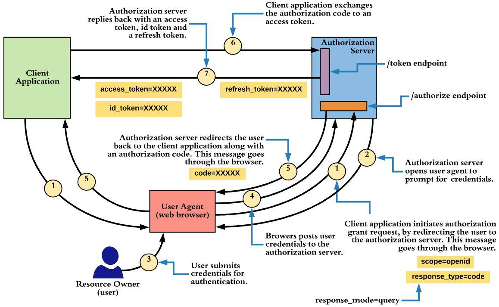

# Laravel + Auth0: Authentication + Authorisation

This is our attempt to try to document Laravel + Auth0 Authentication and Authorisation while creating our own usage patterns for Faith FM.

**WARNING: NO GUARANTEE IS MADE AS TO THE ACCURACY OF THIS INFORMATION.**  It was simply our own brain-dump as we tried to decode it all.  It was initially developed during earlier versions of this package/pattern using the `auth0/login` package (pre v7.0)  and has not been thoroughly updated for some time, however much of the information may still be helpful even if it's dated.


## Authentication, Authorization, State Management, and Sessions
When dealing with HTTP requests, a server usually needs to know the answers to these questions:
1. Who are you?
2. What are you allowed to do?
3. What have you been doing?

* The first question is related to **AuthN**, but for unidentified guests the concept of **session-based identity** is important.
* The second question is related to **AuthZ**.
* The third question is related to **state** management - which is often based around the concept of **session**s.  (see below)

## Laravel Implementation

To answer these questions in a Laravel app requires understanding about:
1. Guards & Providers - [AuthN](https://laravel.com/docs/8.x/authentication#retrieving-the-authenticated-user)
2. Gates - [AuthZ / Permissions](https://laravel.com/docs/8.x/authorization)
3. Session - [HTTP Session](https://laravel.com/docs/8.x/session)


These things are managed for Laravel traditional 'web' (non-'api') routes in the following manner:

### Sessions:
Covered in detail below, but basically the encrypted 'XXX_state' cookie is included with each request, and is used by the **StartSession** middleware to load/manage state.


## Stateless vs Stateful HTTP requests
Web servers receive HTTP requests from browsers.  If a raw request contain no information about the state or identity of the requester, the requests are treated as "stateless" - ie: each request could potentially be from anyone, and the server has no way to maintain history/state as a specific user progresses through various phases of interaction with the server.

There are many ways to manage state & identity during HTTP communication:
* GET/POST parameters  (browser-->server)
* Responses  (server-->browser)
* Request HEADERS    (browser-->server)
* Response HEADERS    (server-->browser)
* COOKIES  (bidirectional)

Browsers can store state in a number of ways:
* Javascript variables (lost each page refresh)
* The DOM itself (lost each page refresh)
* Cookies (IF PERMITTED, expire with time or when cleared, automatically sent/received with each request)
* Local storage (IF PERMITTED, expire with time or when cleared)

Servers can persist state information in a myriad of ways:
* Memory/files/databases/etc

## Session-based State Management Pattern
A common pattern used by traditional web apps is the concept of a "Session":
* Browser makes first request  (stateless)
* Server starts a "session" (indexed by a unique random session-id) and persists "state" information against this session in some sort of storage (ie: file/db/etc)
* The server's response includes the unique session-id - with the intent that the browser will retain this information and pass it back to the server for each subsequent request.
* Cookies are ideally suited for passing session-id information between browser/server since typically cookies are passed back/forth automatically with each request/response cycle, and the do not change unless explicitly modified by the browser or server.
* Assuming the browser doesn't disable the session-id cookie, the server uses this id to reload/manage/save state between requests.

## Laravel's Session Pattern:
* Laravel uses this cookie-based session pattern by default for traditional 'web' (vs 'api') routes.
* (The '**web**' middleware group defined in *app/Http/**Kernel**.php* usually includes the *Illuminate/Session/Middleware/**StartSession**.php*)
* The name of the cookie is usually something like *"your_app_name_local **_session**"*.  This is defined by config('**session.cookie**')) and defaults to a slug based on: "[APP_NAME]_[APP_ENV]_session"... or the SESSION_COOKIE env variable (if defined).
* By  default Laravel encrypts all cookies, so on the surface the session-id ("XXX_session") cookie that you see in the browser won't look the same as the session-id used in the back end.
* By default laravel stores Session information is stored in a file-based back-end, but lots of other options are available.
* Laravel applications can access session data via the `Session::` Facade, and the `session()` helper function.


Authentication (AuthN) and Authorization (AuthZ) are essentially about identity and trust:
* "**Who** are you?" (**identity**) --> Authentication (AuthN)
* "**What** are you allowed to do?" (**trust**/privilege/permission) --> Authorization (AuthZ)

In Faith FM's Laravel systems:
* We rely on a third-party provider (Auth0) to establish the identity of a user.
* Since v4.0.0 we use this Auth0 *'sub'* identifier to load an Eloquent User model which we pass to Laravel's SessionGuard driver, and discard the Auth0 session in favour of the User information retrieved by the SessionGuard.
* We use our own '*user_permission*' table to store additional information about a user's authorization permissions.


Notes:

* Middleware groups (`$middlewareGroups = 'web'/'api'`) and named middleware (`$routeMiddleware = 'auth', 'can', etc`) are defined in app/Http/**Kernel**.php
* These middleware groups are applied to groups of routes when route definition files (ie: routes/**web**.pbp) are loaded in app/Providers/**RouteSerivceProvider**.php
* In Laravel's default configuration, it is easy to become confused between these these middleware groups and Laravel's default authentication 'guards', because because *'web'* and *'api'* are used in both places - see [disambiguation discussion](disambiguation-auth-guard-vs-middleware-group-names.md) here.
* Another story... but there is also lack of clarity in naming conventions in config/**auth**.php between:

  * authentication 'guards'

  * authentication 'drivers'

  * authentication user-'providers'


## Laravel Authentication Basics

The useful part of Laravel Auth docs starts part way down the page: [https://laravel.com/docs/10.x/authentication#retrieving-the-authenticated-user](https://laravel.com/docs/8.x/authentication#retrieving-the-authenticated-user)

Laravel Authentication is based around the ***'auth'* singleton** (which is an instance of Illuminate\\Auth\\**AuthManager**.php class).  This contains one or more 'guards'  (ie: 'web', 'api', etc).

Most of the authentication (AuthManager) functions are actually calling child guard methods - either by automatically passing functions to the default guard, or to a specific guard.

Ie: the "user()" method:     (remember guards are usually a *"SessionGuard"* or a *"TokenGuard"* instance)

* Auth::**user()** - any unknown methods are automatically passed through to the **default** guard   (ie: 'auth.driver' singleton instance - which in our case is the 'web' SessionGuard instance).
* Auth::**guard('myguard')**\->user() - allows a SPECIFIC guard to be nominated  *(when using the Facade accessor)*
* auth('**myguard**')\->user() also allows a SPECIFIC guard to be nominated  *(the helper function accessor points to the specified guard if a string 'myguard' parameter is provided)*

Note: if multiple authentication guards are allowed by a -->middleware('auth:web,api'), the *default* guard will be automatically replaced with the *detected* guard.  This will be used in later calls to Facade/helper accessors (ie: auth()->... or Auth::...).   *The Authenticate middleware replaces the default guard config setting when a valid authentication method is found, via a call to AuthManager::shouldUse($guard).*  Since v4.0.0 we have also provided the auth_guards() helper function to allow multiple guards to be specified in locations other than middleware (documented in main README.)


Samples of what you can do:  (better docs in current README)

```php
use Illuminate\Support\Facades\Auth;

$user = Auth::user();              // currently authenticated user
$user = auth()->user();            // ditto
$user = $request->user();          // if the $request object is available  (ie: via direct injection, etc) - it also contains the ->user instance

$user = Auth::guard('web')->user() // with specific guard - ie: 'web'/'api'
$user = auth('web')->user()        // ditto

$id   = Auth::id();                // currently authenticated user's ID
```

Useful Guard methods:   (many defined in Illuminate/Auth/**GuardHelpers**.php Trait - which forms a key part of the SessionGuard and TokenGuard classes)

```php
user()
id()            - user()->getAuthIdentifier()
guest()         - true if user() IS  null
check()         - true if user() NOT null
check()         - ditto
authenticate()  - same as user()...  BUT throw AuthenticationException if not logged in 
```

Note: if authenticate() throws this exception... it usually **redirects** to something like redirectTo() = route('login'), but this behavior can be modified as per configuration defined in  app/Http/**Middleware**/**Authenticate**.php.  

* In our Faith FM pattern, we generally prefer to do an *abort(404)* and provide a *404 handler* page with a login button... rather than automatically redirecting to the /login page.

## Common ways to check authentication  (AuthN):

* In web.php - add  "**\->middleware('auth')**;"  to the route definition.  Uses similar redirect process to authenticate() guard method (mentioned above). - ie:

```php
Route::get('/myroute', function () {
   ... do stuff
})->middleware('auth');
```

* In a controller constructor, add middleware:

```php
$this->middleware('auth:api,web');
```

* In a controller method, call authenticate():

```php
Auth::authenticate();
```

* In a controller method, check status manually and do different things depending on state:

```php
if (Auth::check())
   // do normal stuff
else
   // return something different if not a valid user
```

* In a blade template use special **@auth**, **@guest**, **@can, @cannot, @canany** directives:      (see: [https://laravel.com/docs/10.x/blade#authentication-directives](https://laravel.com/docs/8.x/blade#authentication-directives))

```HTML
@guest
  You are not logged in.
@else
  @can('use-app')
    Welcome to the {{ config('app.name', 'Laravel') }} system.<br/><br/>
    <a class="btn btn-primary" href="/">Launch app...</a>
  @else
    Your user account does not currently have access to the Faith FM content management system.<br/><br/>
    Please contact a system administator if you need access to this system - providing the email address you used to sign-up / log-in.
  @endcan
@endguest
```

## Common ways to check authorisation  (AuthZ) (Gates):

* Gate::**allows**('mygate')             - true if allowed
* Gate::**denies**('mygate')              - true if not allowed
* Gate::**any**(\['gate1', 'gate2'\])       - true if ANY allowed
* Gate::**check**(\['gate1', 'gate2'\])    - true if ALL allowed
* Gate::**none**(\['gate1', 'gate2'\])    - true if NONE allowed
* Gate::**authorize**('mygate')             - throw a AuthorizationException (403 HTTP response) if not allowed

Note:  our pattern uses the 'faithfm/simple-permissions' package which automatically creates Gates:

* for all `'defined_permissions'` in `config/auth.php`:
* based on permissions defined by the UserPermissions model / 'user\_permissions' table - ie: foreach:
* these are registered in **SimplePermissionsServiceProvider**.php, using Gate::**after()** { ... }


## **Understanding Laravel Auth0 Login Workflow**

Laravel's Auth0 library  (see [quickstart](https://auth0.com/docs/quickstart/webapp/php)) is based around Auth0's "Authorization Code Flow" - see:

* definition and diagram - [https://auth0.com/docs/authorization/flows/authorization-code-flow](https://auth0.com/docs/authorization/flows/authorization-code-flow)

* detailed explanation / API how-to - [https://auth0.com/docs/login/authentication/add-login-auth-code-flow](https://auth0.com/docs/login/authentication/add-login-auth-code-flow)


This is actually based on an OIDC-Conformant Pipeline / **OIDC "Authorization Code Flow"** - see:

* auth0 docs - [https://auth0.com/docs/login/adopt-oidc-conformant-authentication/oidc-adoption-auth-code-flow](https://auth0.com/docs/login/adopt-oidc-conformant-authentication/oidc-adoption-auth-code-flow)

* and generic definition - [https://www.fortinet.com/resources/cyberglossary/oidc](https://www.fortinet.com/resources/cyberglossary/oidc)

* ...and here's a better diagram of the same process ([source](https://medium.facilelogin.com/openid-connect-authentication-flows-936f52380f38))




**Auth0 login/logout Debug Redirect + Functional Steps:**

Basically a detailed run-down of the above diagrams.

/**login** route:

* redirect to Auth0's login URL  (Step #1 & 2)

  * ie: https://youraccount.au.auth0.com/login
    * ?state=XXXXX&protocol=oauth2
    * &redirect_uri=http://your.app.com/callback
    * &scope=openid%20profile%20email
    * &response_mode=query
    * &response_type=code
    * &nonce=XXXX
    * &code_challenge=XXXX
    * &code_challenge_method=S256

  * user submits credentials to Auth0 for verification.  (Steps #3 &#4)
  * redirect after Auth0 to: **/callback** route  (Step #5)

    * See [how-it-works documentation](https://github.com/faithfm/laravel-simple-auth0?tab=readme-ov-file#how-it-works) of our callback method in laravel-simple-auth0.


* * *


**Session storage:**

While a session is valid we try to get the user id from the $session->login\_web\_XXXXXXX stored value.

session->attributes\["login\_web\_59ba36addc2b2f9401580f014c7f58ea4e30989d"\] = user id (from 'users' table)

``` php
core alias: 'auth.driver' => \[\\Illuminate\\Contracts\\Auth\\Guard::class\],

guard registration???

$this->app->singleton('auth.driver', function ($app) {
 return $app\['auth'\]->guard();
});
```

